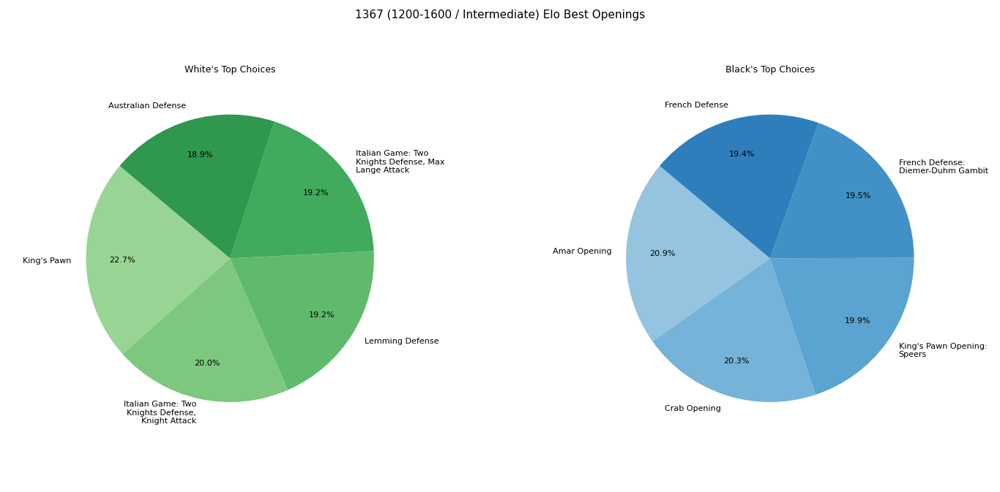

# ♟️ Optimal Opening Finder

This project analyzes a massive dataset of **6 million chess games** to identify the most successful openings for both **White** and **Black** across different Elo levels. Instead of general theory, it provides personalized opening recommendations based on **statistical win rates** within specific skill brackets.

## ⚡ **Performance Optimization**
Handling a 6-million-row dataset requires efficient resource management. To prevent memory overflow, this project implements three key optimizations:
* **Columnar Loading:** Only the necessary columns (`Opening`, `WhiteElo`, `BlackElo`, `Result`) are loaded into memory, drastically reducing the RAM footprint.
* **Data Chunking:** The CSV is processed in segments (**chunks of 500,000 rows**) using **Pandas** to ensure the system remains stable.
* **Manual Garbage Collection:** Utilizing Python's `gc` module to clear memory immediately after processing each chunk.

## 🛠️ **Technologies Used**
* **Python 3.12**
* **Pandas** (Data Manipulation)
* **Matplotlib** (Data Visualization)
* **NumPy** (Numerical Analysis)

## 🚀 **How to Run**

Follow these steps to set up and run the analysis on your local machine:

1. **Clone the Repository**
   ```bash
   git clone [https://github.com/GrkemERD/optimal-opening-finder.git](https://github.com/GrkemERD/optimal-opening-finder.git)
   cd optimal-openings-by-elo

2. **Install Dependencies**
   Ensure you have Python installed, then run:

   ```bash
   pip install -r requirements.txt

   3. **Prepare the Dataset**
   * Download the `chess_games.csv` file from the official source: **Lichess Open Database (Kaggle)**.
   * Place the downloaded file in the root directory of the project and ensure it is named `chess_games.csv`.
   * *Note: The dataset is ignored by Git (.gitignore) to prevent large file uploads.*

4. **Run the Notebook**
   * Open **VS Code** or **Jupyter Lab**.
   * Navigate to your `.ipynb` file.
   * Select your Python kernel and click **Run All**.
   * **Enter your Elo** when prompted in the terminal/cell to generate personalized charts.

## 📈 **Visualizations**
The analysis generates two primary visualizations for the selected Elo range:
1. **White's Top Choices:** A pie chart showing the **5 openings** with the highest win rates for White.
2. **Black's Top Defenses:** A pie chart showing the **5 openings** with the lowest White win rates (meaning highest success for Black).



*Figure 1: Comparison of opening success rates for a specific Elo group.*"""