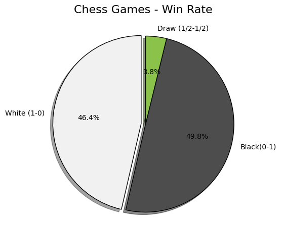

*♟️ 6 Million Chess Games - Win Rate Analysis*

This project focuses on analyzing a massive dataset of **6 million chess games** to determine the win-rate distribution between White and Black pieces.

The analysis is performed using **Python** and **Pandas**, with a specific focus on memory optimization techniques to handle the large file size without crashing the system.

## ⚡ Performance Optimization
Handling a 6-million-row dataset requires efficient resource management. To prevent memory overflow, this project implements two key optimizations:
*   **Columnar Loading:** Only the `Result` column is loaded into memory, drastically reducing the RAM footprint.
*   **Data Chunking:** The CSV is processed in smaller segments (chunks of 100,000 to 500,000 rows) rather than loading the entire file at once.


## 🛠️ Technologies Used
**Python 3.12(.10)**
*   **Pandas**
*   **Matplotlib**

*🚀 How to Run*

Follow these steps to set up and run the analysis on your local machine:

1. **Clone the Repository**
   ```bash
   git clone [https://github.com/GrkemERD/chess-win-rate-analysis.git](https://github.com/GrkemERD/chess-win-rate-analysis.git)
   cd chess-win-rate-analysis

2. **Install Dependencies**
   Ensure you have Python installed, then run:

   ```bash
   pip install -r requirements.txt

3. **Prepare the Dataset**
   * Download the `chess_games.csv` file from the official source: [Lichess Open Database(uploaded to kaggle)](https://www.kaggle.com/datasets/arevel/chess-games).
   * Place the downloaded file in the **root directory** of the project and ensure it is named `chess_games.csv`.
   * *Note: The dataset is ignored by Git to prevent large file uploads.*

4. **Run the Notebook**
   * Open VS Code or Jupyter Lab.
   * Navigate to `notebooks/win_rate_analysis.ipynb`.
   * Select your Python kernel and click **Run All** to see the results and visualizations.

*📈 Visualizations*

*Figure 1: A pie chart representing the total outcome distribution.*

**Note: Findings will be added soon.**

